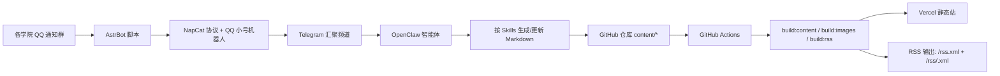

# JXNU PUBLISH

JXNU PUBLISH 是一个面向江西师范大学多学院的信息聚合项目：

- 把各学院通知群消息整合为统一的 24x7 消息源
- 用结构化 Markdown 作为内容中台，静态编译后对外发布
- 同时支持网页浏览与 RSS 订阅，尽量打破学院之间的信息差

这个项目的核心不是“做一个网页”，而是搭建一条可持续运行的消息生产链路：

- QQ 学院群消息转发到 Telegram
- OpenClaw 智能体按 Skills 提取/清洗并写入 Markdown
- GitHub Actions 自动编译并部署，前端只消费生成产物

---

## 消息汇聚流程（Mermaid）



---

## 后端更新方案（GitHub Actions）

内容更新采用你之前讨论的 GitHub Actions 自动化方案，核心思路是“定时拉取 + 结构化写入 + 自动构建发布”：

- 触发方式：定时（建议每 5~15 分钟）+ 手动 `workflow_dispatch`
- 数据输入：Telegram 汇聚源（由 AstrBot + NapCat + QQ 机器人持续转发）
- 智能处理：OpenClaw 按既定 Skills 解析消息、映射学院、补全 frontmatter、写入 `content/card/**/*.md`
- 仓库动作：自动提交内容变更（仅内容目录）
- 发布动作：执行 `pnpm run build`，生成静态站与 RSS 后部署

建议分成两个工作流：

1. `sync-content.yml`：拉消息 -> 调用智能体 -> 更新 Markdown -> 提交
2. `deploy.yml`：构建并部署（Vercel）

---

## 功能特性

- 学院维度聚合（学院汇总流 + 订阅源流）
- 标签、日期、时效（限时/过期）筛选
- 详情弹层阅读与附件优先展示
- 全站 + 分学院 RSS 订阅
- 搜索索引预编译（标题 + 描述 + 正文纯文本）
- Markdown 内容编译与 frontmatter 严格校验

---

## 技术栈

- React 19 + TypeScript
- Vite 6 + Tailwind CSS
- Radix UI + Framer Motion
- gray-matter + marked（内容编译）
- GitHub Actions（自动更新/构建）

---

## 本地开发

### 1) 安装依赖

```bash
pnpm install
```

### 2) （可选）生成示例内容

```bash
pnpm run generate:sample
```

### 3) 编译内容

```bash
pnpm run build:content
```

### 3.1) 生成 RSS（全站 + 分学院）

```bash
pnpm run build:rss
```

### 3.2) 生成封面自适应 WebP 版本

```bash
pnpm run build:images
```

### 4) 启动开发服务器

```bash
pnpm run dev
```

默认地址：`http://localhost:5173`

---

## 构建与预览

```bash
pnpm run build
pnpm run preview
```

说明：`build` 前会自动执行 `prebuild`（内容编译 + RSS 生成）。

当前 `prebuild` 会自动执行：

- `pnpm run build:content`
- `pnpm run build:images`
- `pnpm run build:rss`

可选环境变量：

- `SITE_URL`（推荐）或 `RSS_SITE_URL`
  - 用于生成 RSS 里的绝对链接。
  - 未设置时默认使用 `https://jxnu-publish.vercel.app`。

---

## 内容目录说明

- `content/card/**/*.md`：通知卡片正文与 frontmatter（建议按学院 slug 分子目录管理）
- `content/conclusion/*.md`：学院总结与 `daily` 按日总结
- `config/subscriptions.yaml`：订阅结构与学院映射（唯一配置源）
- `public/generated/*.json`：前端运行时加载数据
- `public/covers/*`：由 `content/card/covers` 同步的封面资源

---

## 订阅配置结构

`config/subscriptions.yaml` 采用“学院包裹订阅源”的层级结构：

- 学院层字段：`slug`、`name`、`short_name`、`order`、`icon`
- 订阅层字段：`title`、`number`（可选）、`url`、`icon`、`enabled`、`order`
- 卡片 frontmatter 不再手写 `subscription_id`，编译时由 `school_slug + source.channel` 自动推导：
  - 规则：`<school_slug>-<slugify(source.channel)>`

示例：

```yaml
version: 2
schools:
  - slug: ai
    name: 人工智能学院
    short_name: 计信院
    order: 10
    icon: ""
    subscriptions:
      - title: 25-26学年学生干部通知群
        number: "123456789"
        url: ""
        icon: ""
        enabled: true
        order: 30
```

说明：`order` 为学院内排序；`number` 仅用于人工查阅（如同名群区分），不参与前端展示；若同一学院下两个订阅生成出相同 id，编译会直接报错。

---

## 卡片 Frontmatter 示例

```md
---
id: "20260201-ai-001"
school_slug: "ai"
title: "示例通知"
description: "通知摘要"
published: 2026-02-01T09:00:00+08:00
category: "通知公告"
tags: ["报名事项", "截止提醒"]
pinned: false
cover: ""
badge: ""
extra_url: ""
start_at: ""
end_at: ""
source:
  channel: "25-26学年学生干部通知群"
  sender: "示例发送方"
attachments: []
---

通知正文（Markdown）
```

---

## 部署

项目已包含 `vercel.json`，可直接部署到 Vercel（静态前端 + SPA rewrites）。

最简流程：

1. 推送代码到 GitHub
2. 在 Vercel 导入仓库
3. Build Command 使用默认（`pnpm run build`）
4. Output Directory 为 `dist`

---

## RSS 订阅地址

- 全站：`/rss.xml`
- 分学院：`/rss/<school_slug>.xml`
  - 示例：`/rss/ai.xml`

---

## License

[MIT](./LICENSE)
