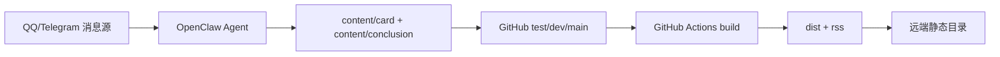

# JXNU PUBLISH

JXNU PUBLISH 是一个面向江西师范大学多学院的通知聚合站。它把消息源统一沉淀为结构化 Markdown，再通过静态编译生成前端数据和 RSS。

## 项目目标

- 聚合学院通知，减少信息差。
- 保持内容仓库可审计、可追溯、可自动部署。
- 支持网页阅读、筛选、搜索与 RSS 订阅。

## 端到端链路



## 分支与发布策略

- `dev`: 日常开发与功能验证。
- `test`: 自动化内容写入与测试环境发布。
- `main`: 人工审核后生产发布。

当前工作流：

- `./.github/workflows/deploy.yml`
  - 触发：`test` 分支 push。
  - 行为：拉取远端 `generated/content-data.json` -> `pnpm run build` -> `rsync dist/` 到测试站目录。
- `./.github/workflows/deploy-main.yml`
  - 触发：`main` 分支 push。
  - 行为：同上，部署到生产目录。
  - 支持 `PROD_*` secrets，不填时回退到默认 `DEPLOY_*`（`PROD_DEPLOY_PATH` 仍建议单独配置）。

## 主要功能

- 学院汇总、订阅源流、全校汇总三种视角。
- 全校模式蓝色学院标签，点击直达学院汇总。
- 标签、日期、时效筛选；搜索标题+正文索引。
- 限时活动进度条与读秒展示（<10 分钟）。
- 详情弹层附件优先展示，支持来源提示。
- RSS：全站 + 分学院。

## 本地开发

```bash
pnpm install
pnpm run dev
```

默认地址：`http://localhost:5173`

## 构建命令

```bash
pnpm run build:content
pnpm run build:images
pnpm run build:rss
pnpm run build
pnpm run preview
```

`pnpm run build` 前会自动执行 `prebuild`：

- `build:content` 生成 `public/generated/content-data.json`
- `build:images` 生成封面 webp 变体（增量）
- `build:rss` 生成 `public/rss.xml` 与 `public/rss/*.xml`

## 内容结构

- `content/card/**/*.md`: 通知卡片。
- `content/conclusion/*.md`: 学院总结与 daily 总结。
- `config/subscriptions.yaml`: 学院与订阅配置唯一来源。
- `public/generated/*.json`: 前端加载数据。

## 订阅配置规则

`config/subscriptions.yaml`:

- 学院字段：`slug` `name` `short_name` `order` `icon`
- 订阅字段：`title` `number?` `url` `icon` `enabled` `order`
- `number` 仅用于人工查阅（同名群区分），不参与前端展示。

关于 `number` 的实践建议：

- 当多个订阅 `title` 相同或高度相似时，为每个订阅补一个稳定 `number`（QQ群号/内部编号）。
- Bot 在工作日志中应记录 `school_slug + title + number`，便于后续追踪与人工核对。

## 卡片 frontmatter 规则（当前实现）

- 必填：`id` `school_slug` `title` `description` `published` `source`。
- 不再手写：`school_name` `subscription_id`。
- `subscription_id` 由编译器根据 `school_slug + source.channel` 自动推导。
- 缺失/无效 `school_slug` 会回退到 `unknown`。
- 缺失或无法匹配 `source.channel` 会回退到 `{school_slug}-未知来源`。

补充通知处理约定：

- `补充通知`、`更正通知`、`二次通知` 优先并入原卡片，不单独新建重复卡片。
- 并入后 `published` 更新为该通知链最新时间，并同步更新附件和受影响的时间字段。

示例：

```md
---
id: "20260201-ai-001"
school_slug: "ai"
title: "示例通知"
description: "通知摘要"
published: '2026-02-01T09:00:00+08:00'
category: "通知公告"
tags: ["报名事项", "截止提醒"]
pinned: false
cover: ""
badge: ""
extra_url: ""
start_at: ""
end_at: ""
source:
  channel: "25-26学年学生干部通知群"
  sender: "示例发送方"
attachments: []
---

通知正文（Markdown）
```

## 前端分页与路由

- 页码通过 URL 查询参数 `p` 同步：`/school/ai?p=3`。
- PC 端点击分页 `...` 可输入页码跳转。
- 手机端点击 `当前页/总页` 可输入页码跳转。

## 部署与环境变量

核心 secrets（测试环境）：

- `SITE_URL`
- `DEPLOY_HOST`
- `DEPLOY_PORT`
- `DEPLOY_USER`
- `DEPLOY_PATH`
- `DEPLOY_SSH_KEY`

生产环境可使用 `PROD_*` 对应变量（main workflow）。

## RSS 地址

- 全站：`/rss.xml`
- 分学院：`/rss/<school_slug>.xml`

## License

[MIT](./LICENSE)
